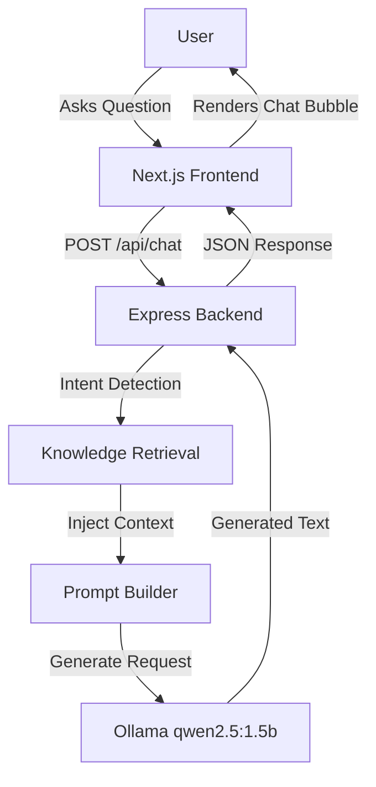

# Kunal AI – Personal Portfolio Chatbot

## Project Overview
Kunal AI is a personalized, AI-powered interactive portfolio chatbot. Instead of browsing a static resume, users can naturally chat with the AI to learn about Kunal Kavathekar's professional background, education, technical skills, projects, and achievements. Powered by a local installation of Ollama, it provides completely private, highly accurate responses tailored from a curated, offline knowledge base.

## Features
- **Conversational Resume**: Chat directly with an AI trained exclusively on Kunal's portfolio and resume.
- **Privacy-First AI**: Runs entirely locally using Ollama. No data is sent to external LLM providers (e.g., OpenAI, Anthropic).
- **Zero Hallucination Retrieval**: Implements a lightweight RAG (Retrieval-Augmented Generation) pipeline using local JSON and TXT files, ensuring responses remain 100% factual.
- **Dynamic Theming**: Seamless dark and light mode support built natively with Tailwind CSS and React Context.
- **Responsive Design**: Flawlessly adapts across Desktop, Tablet, and Mobile screens.

## Technology Stack
- **Frontend**: Next.js, React.js, Tailwind CSS
- **Backend**: Node.js, Express.js
- **AI Infrastructure**: Ollama (Running `qwen2.5:1.5b` locally)
- **Data Layer**: Custom JSON/TXT Files (No external database required)

## Architecture

The project employs a streamlined Retrieval-Augmented Generation (RAG) architecture tailored for lightweight local execution without external dependencies.



## Project Structure
```text
kunal-ai-personal-portfolio-chatbot/
├── backend/            # Express.js REST API
│   ├── src/
│   │   ├── controllers/
│   │   ├── middleware/
│   │   ├── routes/
│   │   ├── services/
│   │   └── utils/
│   └── .env.example
├── docs/               # Architecture, PRD, and testing documentation
├── knowledge-base/     # Local data store containing resume details
│   ├── documents/      # TXT versions of resume, linkedin, etc.
│   └── json/           # Structured attributes (skills, education, etc.)
└── src/                # Next.js Frontend
    ├── app/            # Next.js App Router (page.js, layout.js)
    ├── components/     # React Components (ChatContainer, ChatInput)
    ├── context/        # React Context (ThemeContext)
    └── styles/         # Global Tailwind CSS
```

## Screenshots
> *Placeholder for Demo GIF*
> 

> *Placeholder for Dark Mode*
> 

> *Placeholder for Light Mode*
> 

## Installation

### Prerequisites
- Node.js (v18+)
- npm or yarn
- Ollama (installed locally)

### 1. Clone the Repository
```bash
git clone https://github.com/KunalSK36/kunal-ai-portfolio.git
cd kunal-ai-portfolio
```

### 2. Install Dependencies
**Root (Frontend):**
```bash
npm install
```

**Backend:**
```bash
cd backend
npm install
cd ..
```

## Environment Variables
Create a `.env` file in the `backend/` directory. You can use the provided `.env.example`:

```bash
cd backend
cp .env.example .env
```
Ensure your `.env` contains:
```env
PORT=5000
OLLAMA_URL=http://localhost:11434
OLLAMA_BASE_URL=http://localhost:11434
OLLAMA_MODEL=qwen2.5:1.5b
```

## Running Ollama
Before starting the backend, ensure your local Ollama daemon is running and the required model is pulled.

1. Install Ollama from [ollama.com](https://ollama.com).
2. Start the Ollama application or daemon.
3. Pull the required lightweight model:
```bash
ollama run qwen2.5:1.5b
```

## Running Backend
Start the Express server on port `5000`.
```bash
cd backend
npm run dev
```

## Running Frontend
Start the Next.js development server on port `3000`.
```bash
# In a new terminal at the project root
npm run dev
```
Open [http://localhost:3000](http://localhost:3000) in your browser.

## Example Questions
The bot is trained to answer professional and academic questions. Try asking:
- *"Tell me about yourself."*
- *"What projects have you worked on?"*
- *"Tell me about PathReco."*
- *"What is your CGPA?"*
- *"Do you have any patents?"*

## Knowledge Base Structure
The `knowledge-base/` directory is isolated from application logic. Updating Kunal's resume simply involves editing these JSON and TXT files. 
- `/json/experience.json` - Professional internships and work history
- `/json/skills.json` - Technical languages, frameworks, and tools
- `/json/projects.json` - Detailed portfolio of developed applications
- `/documents/resume.txt` - Unstructured text used for broader context matching

## Documentation
The `docs/` folder contains extensive project history, specifications, and testing reports detailing the journey of this build.
- `PRD.md`: Product Requirements Document
- `TechSpec.md`: Technical specifications
- `Design.md`: UI/UX tokens and choices
- `TestReport.md`: Metrics for speed, validation, and responsiveness

## Future Improvements
- **Vector Search Expansion:** Migrate from keyword heuristic matching to Vector Embeddings (e.g., ChromaDB) as the knowledge base grows.
- **Conversational Memory:** Add persistent session history so the LLM remembers previous context in the thread.
- **Response Streaming:** Implement HTTP streaming to reduce perceived latency and provide a typewriter effect.

## Author
**Kunal Shrikant Kavathekar**  
[GitHub](https://github.com/KunalSK36) | [LinkedIn](https://www.linkedin.com/in/kunal-kavathekar)

## License
This project is licensed under the MIT License.
